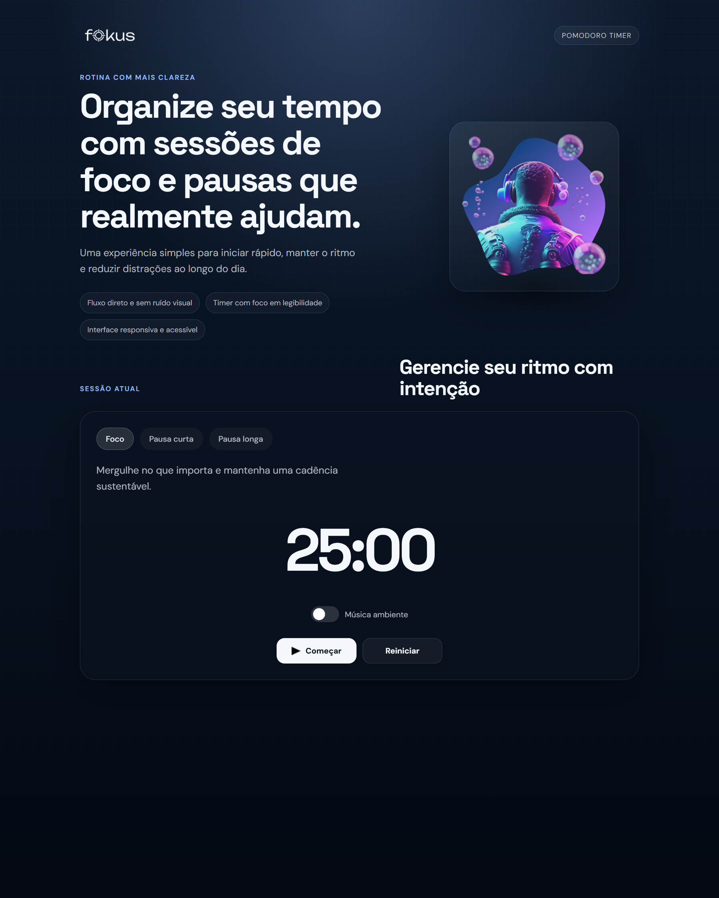
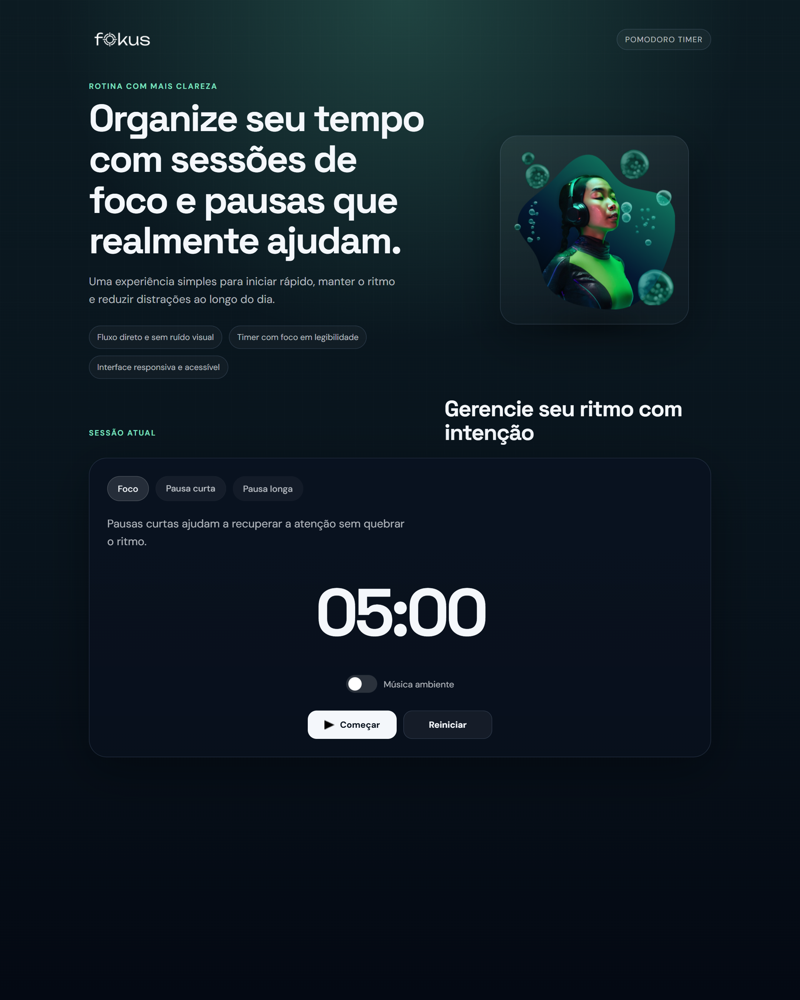

# Fokus

Aplicação inspirada na técnica Pomodoro para organizar blocos de foco, pausa curta e pausa longa em uma interface clean, responsiva e orientada à legibilidade.

## Visão geral

O objetivo deste projeto é oferecer uma experiência simples para gestão de tempo, com transições de contexto, trilha sonora opcional e interface pensada para reduzir ruído visual.

## Preview

### Tela principal



### Modo pausa curta



## Melhorias aplicadas nesta versão

- Estrutura HTML mais semântica e acessível
- Interface visual mais minimalista e consistente
- Timer com comportamento mais previsível e código TypeScript mais legível
- Feedback não bloqueante ao concluir ou reiniciar sessões
- README reescrito para apresentação profissional em portfólio

## Tecnologias

- HTML5
- CSS3
- TypeScript
- JavaScript

## Como executar localmente

1. Instale as dependências:

```bash
npm install
```

2. Gere o build do TypeScript:

```bash
npm run build
```

3. Abra o arquivo `index.html` no navegador.

## Estrutura do projeto

```text
src/
  css/
  imagens/
  sons/
  ts/
dist/
index.html
```

## Deploy

Projeto publicado em:
[fokus-fnovitchs-projects.vercel.app](https://fokus-fnovitchs-projects.vercel.app/)
